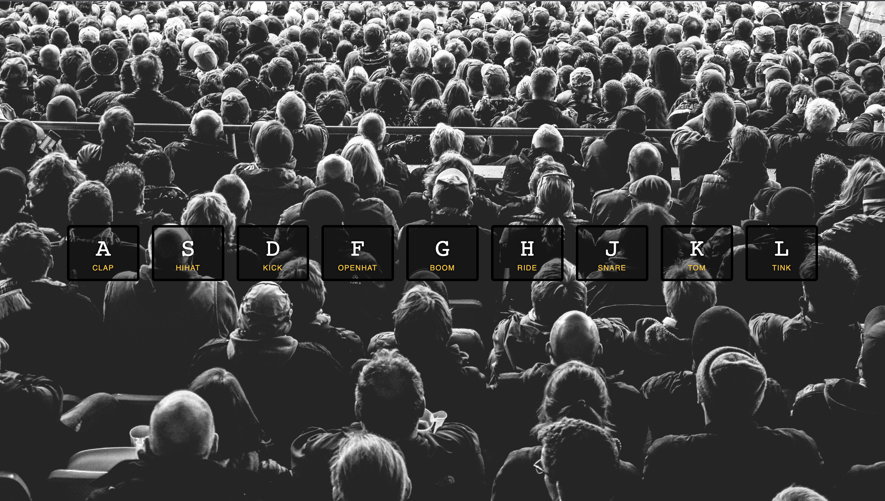

# Drumkit App

## Description

This is a drumkit application which is apart of the Wes Bros "Javascript 30 - 30 Day Vanilla JS Coding Challenge."

Here is the link for the course: https://javascript30.com.

The user should be able to play drum sounds when the corresponding key is clicked.

## Built With

- HTML
- CSS
- JavaScript

## Demo

https://johngibbs15.github.io/Drumkit-Application/
